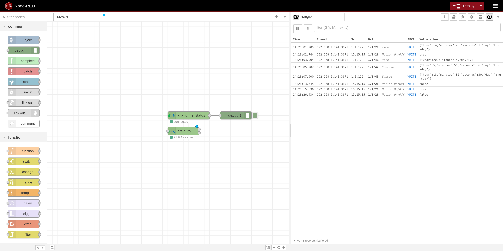
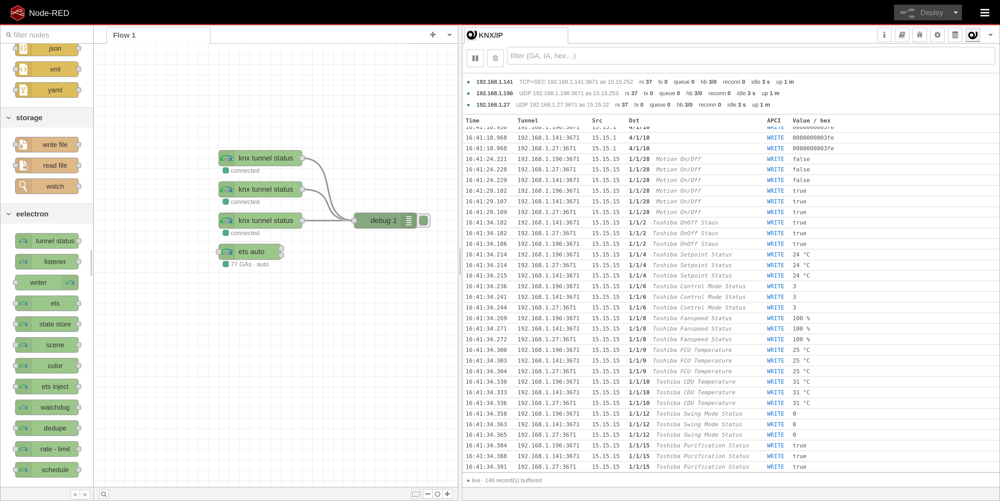

# node-red-contrib-eelectron-knxip

> Stable, ETS-aware Node-RED nodes for KNX/IP automation — with UDP tunneling, KNX/IP Secure over TCP, live bus monitoring, gateway discovery, and DPT auto-encoding.



Multi-tunnel safe out of the box — every config node owns its own socket
and sequence counters, so several KNX/IP gateways can run side-by-side
without interference. The bus monitor and the per-tunnel diagnostics strip
make this visible at a glance:



---

## 🚀 What is it?

`node-red-contrib-eelectron-knxip` brings reliable KNX/IP communication into Node-RED with a modern workflow built around ETS projects.

It supports classic KNX/IP tunneling, **KNX/IP Secure tunneling over TCP**, automatic DPT handling from ETS data, a live in-editor bus monitor, and a set of typed helper nodes for common KNX tasks like scenes, colors, state caching, and writes.

Whether you are building a simple light-control flow or a full KNX automation dashboard, this package gives you a stable bridge between Node-RED and your KNX installation.

---

## ✨ Highlights

| Feature | Description |
|---|---|
| 🧱 Stable tunnel client | Clean connection state machine, heartbeat, auto-reconnect, duplicate suppression, and safe multi-tunnel usage. |
| 🔐 KNX/IP Secure | Secure tunneling over TCP with X25519 ECDH, AES-CBC-MAC, and AES-CCM. Verified end-to-end against real KNX/IP interfaces. |
| 📡 Live bus monitor | Real-time telegram stream directly inside the Node-RED editor sidebar, with per-tunnel diagnostics (TX / RX / heartbeat / reconnect counters, idle time, uptime). |
| 🧠 ETS-aware encoding | Load a CSV or `.knxproj` and let listener, writer, inject, and monitor nodes auto-pick the correct DPT codec. |
| 🔎 Gateway discovery | Discover KNX/IP interfaces on your LAN from the tunnel-config dialog. |
| ⚡ Editor autocomplete | Group address and DPT fields suggest values from your bound ETS project and codec registry. |
| 🛡️ Defensive primitives | Read-on-connect, anti-loop dedupe, GA wildcards, all-from-ETS subscription, and raw passthrough fallback. |

---

## 🔐 KNX/IP Secure

This package supports **KNX/IP Secure tunneling over TCP** with the full secure handshake flow:

- X25519 ECDH key exchange
- AES-CBC-MAC authentication (the MAC algorithm KNX/IP Secure §4.5 specifies)
- AES-CCM (CTR + CBC-MAC) encrypted communication
- Secure credential handling
- ETS project password support
- Per-user password extraction from `.knxproj`

Credentials can be autofilled from a `.knxproj` using the project password. Passwords are decrypted server-side and stored encrypted at rest in Node-RED’s credentials file.

They are **never written to `flows.json`**.

---

## 📡 Live Bus Monitor

The built-in sidebar monitor streams every received KNX telegram in real time using Server-Sent Events.

It shows:

- Source individual address
- Group address
- Group address name from ETS
- APCI type
- Decoded value
- Units where available
- Raw telegram data when needed

You can filter by:

- Group address
- Name
- DPT
- Hex payload
- Decoded value substring

Perfect for debugging, commissioning, and watching the bus breathe. 🌬️

---

## 🧠 ETS-Driven Workflow

Load your ETS data once and let the nodes do the heavy lifting.

Supported project sources:

| Source | Supported |
|---|---|
| CSV group-address export | ✅ |
| Comma-separated CSV | ✅ |
| Semicolon-separated CSV | ✅ |
| Tab-separated CSV | ✅ |
| CSV with headers | ✅ |
| CSV without headers | ✅ |
| Full `.knxproj` archive | ✅ |
| Password-protected ETS6 archives | ✅ |

Once loaded, the ETS map powers:

- Listener decoding
- Writer auto-encoding
- Inject node payload hints
- Sidebar bus monitor names and values
- Group address autocomplete
- DPT autocomplete
- Secure interface discovery and credential autofill
- One-click *Generate starter flow* — drops a tab populated with a
  shared listener+debug, a shared writer, and one inject per GA
  pre-filled with the GA, ready for test writes

---

## 🧩 Nodes

### 🔌 Connection & Status

| Node | Purpose |
|---|---|
| `eelectron-knxip-config` | KNX/IP gateway connection settings. |
| `eelectron-knxip-status` | Emits tunnel state, queue depth, and last error. |

---

### 📥 Bus I/O

| Node | Purpose |
|---|---|
| `eelectron-knxip-listener` | Subscribes to group addresses using exact matches, wildcards, or all addresses from ETS. Supports optional read-on-connect. |
| `eelectron-knxip-writer` | Sends `GroupValueWrite` and `GroupValueRead`. Supports ETS-driven DPT lookup and optional dedupe windows. |

---

### 🗂️ ETS Project

| Node | Purpose |
|---|---|
| `eelectron-knxip-ets-config` | Stores a parsed ETS project from CSV or `.knxproj`. Also exposes secure interface data to the tunnel config dialog. |
| `eelectron-knxip-ets` | Translates APDUs to scalar values or encodes scalars to APDUs based on `msg.topic` and the ETS map. |
| `eelectron-knxip-ets-inject` | Manual or scheduled inject node with a GA picker and DPT-aware payload hints. |

The `eelectron-knxip-ets` node has two outputs:

1. Decoded values
2. Raw passthrough for custom decoding

---

### 🛠️ Convenience Nodes

| Node | Purpose |
|---|---|
| `eelectron-knxip-state-store` | Caches the last value per group address. Query with `msg.action = 'get'`, `'list'`, or `'clear'`. |
| `eelectron-knxip-scene` | Typed encoder for DPT `17.001` and `18.001`. Supports scene number, activate, and learn. |
| `eelectron-knxip-color` | Typed encoder for DPT `232.600` RGB and DPT `251.600` RGBW. Accepts hex, `rgb()`, `rgba()`, or color objects. |
| `eelectron-knxip-watchdog` | Watches a list of GAs and emits an `alarm` message when one has been silent longer than the configured timeout, and a `recovery` message when it speaks again. Use it for HVAC sensors, presence detectors, weather feeds, or any GA that should publish on a predictable cadence. |
| `eelectron-knxip-dedupe` | Drops repeat `(topic, payload)` pairs within a configurable window. Useful for cleaning a noisy listener and breaking write → listener feedback loops. |
| `eelectron-knxip-rate-limit` | Caps msgs/window per topic so a runaway flow can't storm the bus. Drops excess by default; optional second output exposes the dropped messages for logging or alarming. |
| `eelectron-knxip-schedule` | Fires a configured payload to a chosen GA on a cron expression (5-field, with `*`, ranges, lists, and steps) or an interval. Output shape matches `ets-inject` so it pipes directly into a writer with the same ETS config. |
| `eelectron-knxip-mqtt-publish` | KNX → MQTT bridge: filters listener output by ETS-project membership, renders configurable topic + payload templates (`{ga}`, `{gaName}`, `{dpt}`, `{source}`, `{ts}`, `{value}`), strips internals, drops in front of any `mqtt out`. |

---

## 🧬 Supported DPTs

The codec library supports the following DPT families:

```txt
DPT 1, 2, 3, 4, 5, 6, 7, 8, 9,
10, 11, 12, 13, 14, 16, 17, 18,
19, 20, 26, 28, 29, 232, 235, 251
```

158+ specific sub-types registered across those families (boolean / step
/ scaled / raw integers / KNX 2-byte float / IEEE float / time / date /
date+time / strings / scene info / scene control / energy + tariff /
RGB / RGBW / 64-bit energy totals / UTF-8).

These cover:

| Category | Examples |
|---|---|
| Boolean values | Switches, enables, alarms |
| Step controls | Dimming, blinds, relative movement |
| Integers | Scaled values, counters, raw numeric payloads |
| Floats | KNX 2-byte float, IEEE float |
| Time values | Time, date, date + time |
| Text values | Characters and strings |
| Scenes | Scene number, activate, learn |
| Energy values | Energy and tariff data |
| Colors | RGB and RGBW |

Unknown sub-types fall back to the family default.

For example:

```txt
DPT-7 → 7.001
```

If a group address uses a DPT that is not yet implemented in the codec library, the ETS translator routes it to the raw passthrough output so a function node can handle it manually.

---

## 📦 Examples

After installation, import ready-made example flows from Node-RED:

```txt
Import → Examples → node-red-contrib-eelectron-knxip
```

Available examples:

| # | Example |
|---:|---|
| 01 | Tunnel status |
| 02 | Raw bus monitor |
| 03 | Decoded bus monitor with ETS |
| 04 | Switch control, DPT 1 |
| 05 | Dimmer control, DPT 5 / DPT 3 |
| 06 | Custom decoder for output 2 |
| 07 | Writer with ETS auto-encode |
| 08 | State store cache |
| 09 | Scene control, DPT 17 / 18 |
| 10 | Colour control, DPT 232 / 251 |
| 11 | Full project monitor with all ETS GAs and read-on-connect |
| 12 | Anti-loop dedupe demo |
| 13 | KNX/IP Secure tunnel with decoded bus monitor |
| 14 | ETS-aware inject node |
| 15 | Secure write through ETS-inject and writer |
| 16 | Watchdog — alarm on a stale sensor |
| 17 | Dedupe + rate-limit (clean stream + outbound throttle) |
| 18 | Scheduled KNX write (cron + interval) |
| 19 | KNX → MQTT bridge (filtered by ETS project) |

---

## 🐳 Docker deployment

A ready-to-run Node-RED container that installs this package is available at:

[**eelectronspa/node-red**](https://github.com/eelectronspa/node-red)

It pulls the latest `main` of this repo, builds it inside the container, and drops the result into the Node-RED user-data directory so flows persist across rebuilds.

```bash
git clone https://github.com/eelectronspa/node-red.git
cd node-red/containers
./docker.bash compose up
```

Follow the repo's README for `adminAuth` setup and the one-liner that installs `node-red-contrib-eelectron-knxip` into the running container.

---

## 🧪 Development

Install dependencies:

```bash
npm install
```

Build the package:

```bash
npm run build
```

Run tests:

```bash
npm test
```

Create a local package archive:

```bash
npm pack
```

The generated `.tgz` can be installed in Node-RED via:

```txt
Palette → Install → Upload
```

---

## 🚢 Releasing

Tagged commits trigger the **Release** GitHub Action.

The workflow builds the package and attaches the generated `.tgz` to a new GitHub Release.

Release notes are taken from the **annotated tag message**, giving you full control over the changelog at tag time.

### 1. Bump the version

```bash
npm version patch
```

You can also use:

```bash
npm version minor
npm version major
```

This creates both a version commit and a local `v*` tag.

---

### 2. Replace the generated tag with an annotated one

```bash
git tag -d v0.5.1

git tag -a v0.5.1 -m "Release v0.5.1

- short bullet list of user-facing changes
- another change
"
```

---

### 3. Push the commit and tag

```bash
git push --follow-tags
```

---

## 🧾 Release Notes

Prefer GitHub’s auto-generated commit list instead of handwritten release notes?

Set this in `.github/workflows/release.yml`:

```yaml
generate_release_notes: true
```

The release workflow refuses to publish if the Git tag and `package.json` version disagree.

That means you can safely use `npm version`, or manually edit both values, as long as they stay aligned.

---

## ✅ Continuous Integration

The CI workflow runs tests on every push and pull request against `main`.

Tested Node.js versions:

```txt
18 / 20 / 22
```

The build process:

1. Compiles TypeScript to `dist/`
2. Copies HTML assets
3. Copies SVG assets
4. Prepares node modules for packaging

---

## 📜 License

Licensed under the [Apache License 2.0](./LICENSE).

See [NOTICE](./NOTICE) for trademark information.

The **eelectron** brand and package name are not granted under the Apache license. Forks intended for redistribution must use a different name.

---

## 🏠 Built for practical KNX automation

Reliable tunnels.  
Secure communication.  
ETS-aware payloads.  
A live monitor where you actually need it: inside the editor.

Happy wiring. ⚡